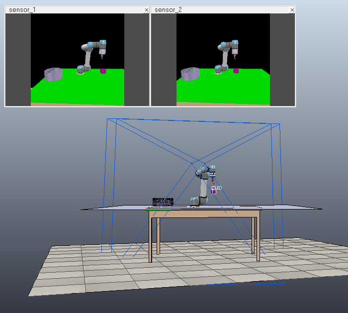

# pick_and_place_3D
Transferring End-to-End Visuomotor Control fromSimulation to Real World for a Multi-Stage Task -> 3D grasp, stereo images

## 3D generalization of the task from paper `Transferring End-to-End Visuomotor Control fromSimulation to Real World for a Multi-Stage Task` for arbitrary initial position of the cube in space

### cnnlstm_3D.ttt
V-REP scene for pick (cube) and place (to the box) task for arbitrary initial position of the cube in space

### VREP_pick_trajektorie_simpler_3D.py
generate sequences of images and data for the pick (cube) and place (to the box) task from the V-REP scene

### IM2J_keras_iterator_last_val_with_gripper_joints_3D.py
imitation learning from generated sequences

### IM2J_vrep_test_joints_simpler_3D.py
navigate V-REP scene by learned neural network

### V-REP support
remoteApi.so , vrep.py , vrepConst.py
